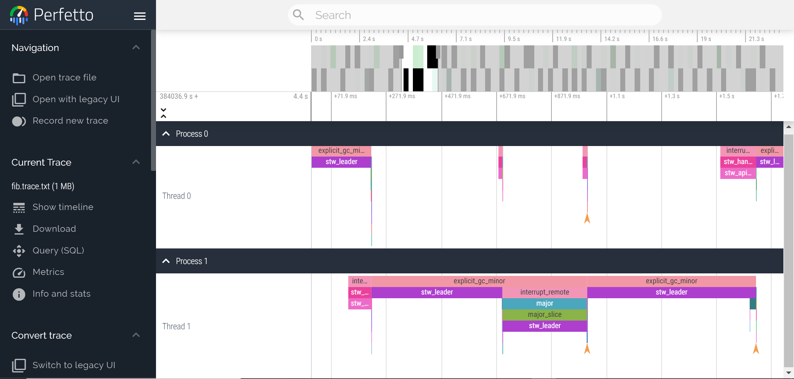
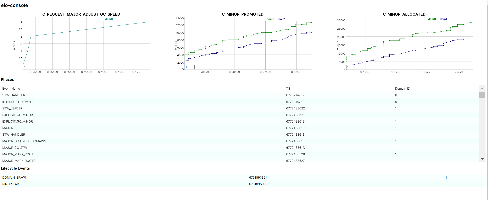

Runtime Events Workshop Demo
----------------------------

A repository containing the source code for the Runtime Events Workshop demo presented at the [OCaml Workshop](https://icfp22.sigplan.org/home/ocaml-2022) as part of [ICFP 2022](https://icfp22.sigplan.org/) by [Sadiq Jaffer](https://github.com/sadiqj) and [Patrick Ferris](https://github.com/patricoferris). The [abstract](./abstract.pdf) is available too.

- [Runtime Events Workshop Demo](#runtime-events-workshop-demo)
- [Setup](#setup)
- [Introduction](#introduction)
- [GC Stats](#gc-stats)
  - [The Runtime Events Library](#the-runtime-events-library)
  - [Runtime GC Counters](#runtime-gc-counters)
  - [Registering Callbacks](#registering-callbacks)
  - [Enabling Runtime Events for Programs](#enabling-runtime-events-for-programs)
  - [Recording GS-stats](#recording-gs-stats)
- [Runtime Events Tools](#runtime-events-tools)
  - [GC Tail Latencies](#gc-tail-latencies)
  - [Perfetto Output](#perfetto-output)
- [Eio-console](#eio-console)
  - [Web-browser Interface](#web-browser-interface)

## Setup

This repository uses a `.devcontainer` to hopefully make reproducing the demonstration as straightforward as possible. Using [VSCode/VSCodium](https://github.com/VSCodium/vscodium) with remote containers should automatically open this repository in a devcontainer with all of the platform tools and plugins ready to go.

## Introduction

There are three demonstrations in this repository.

 - GC stats shows a simple program that runs a user-supplied program and monitors the total allocated minor words, promote minor words and major allocated words. The explanation below also goes into more detail about the program, the library `runtime_events` and the available probes. This is a good place to start if you are unfamiliar with continuous monitoring and the OCaml runtime.
 - Olly shows how you can use existing, released *runtime events tools* to monitor your program and investigate potential bugs.
 - Eio-console shows how you can build more complicated user interfaces for analysing programs.

Once OCaml 5 is officially release, the best place to look for documentation will be the [OCaml manual](https://github.com/ocaml/ocaml/blob/trunk/manual/src/cmds/runtime-tracing.etex).

## GC Stats

OCaml programs exist within the OCaml runtime. This is an execution environment that manages certain aspects of the running program. In particular the management of memory. The garbage collector (GC) is a core component of a running OCaml program. Users do not have to manually allocate memory, but should be aware of common patterns and data-structures that require allocation as this can have a large impact on the memory profile and efficiency of your program.

### The Runtime Events Library

The `runtime_events` library is an OCaml `otherlib` similar to the `unix` library and the `threads` library. This means that the library is shipped with the compiler, but must be explicitly listed in your dune file in order to be able to use the library.

<!-- $MDX file=src/gc-stats/dune -->
```dune
(executable
 (name main)
 (public_name gcstats)
 (package runtime-events-workshop)
 (libraries unix runtime_events))
```

In this workshop and demonstration we will focus on the OCaml API. It is important to note, there is a [C API too](https://github.com/ocaml/ocaml/blob/trunk/runtime/caml/runtime_events.h).

The runtime events library exposes three kinds of events: spans over time, counters for things like minor allocated words and lifecycle events (one off events in time). These have corresponding types.


```ocaml
# #show_type Runtime_events.runtime_counter;;
type nonrec runtime_counter =
    EV_C_FORCE_MINOR_ALLOC_SMALL
  | EV_C_FORCE_MINOR_MAKE_VECT
  | EV_C_FORCE_MINOR_SET_MINOR_HEAP_SIZE
  | EV_C_FORCE_MINOR_MEMPROF
  | EV_C_MINOR_PROMOTED
  | EV_C_MINOR_ALLOCATED
  | EV_C_REQUEST_MAJOR_ALLOC_SHR
  | EV_C_REQUEST_MAJOR_ADJUST_GC_SPEED
  | EV_C_REQUEST_MINOR_REALLOC_REF_TABLE
  | EV_C_REQUEST_MINOR_REALLOC_EPHE_REF_TABLE
  | EV_C_REQUEST_MINOR_REALLOC_CUSTOM_TABLE
```

The runtime has been augmented in carefully choosen places to report specific events. For example within the `runtime/minor_gc.c` code we find the following.

```c
CAML_EV_COUNTER(EV_C_MINOR_PROMOTED,
                Bsize_wsize(domain->allocated_words - prev_alloc_words));

CAML_EV_COUNTER(EV_C_MINOR_ALLOCATED, minor_allocated_bytes);
```

These events are the used in conjunction with the callback function to allow runtime events tool writers to differentiate between different events and their associated payloads.

```ocaml
# Runtime_events.Callbacks.create;;
- : ?runtime_begin:(int ->
                    Runtime_events.Timestamp.t ->
                    Runtime_events.runtime_phase -> unit) ->
    ?runtime_end:(int ->
                  Runtime_events.Timestamp.t ->
                  Runtime_events.runtime_phase -> unit) ->
    ?runtime_counter:(int ->
                      Runtime_events.Timestamp.t ->
                      Runtime_events.runtime_counter -> int -> unit) ->
    ?alloc:(int -> Runtime_events.Timestamp.t -> int array -> unit) ->
    ?lifecycle:(int ->
                Runtime_events.Timestamp.t ->
                Runtime_events.lifecycle -> int option -> unit) ->
    ?lost_events:(int -> int -> unit) -> unit -> Runtime_events.Callbacks.t
= <fun>
```

A user creates a new `Callback.t` value using this function and can decided what events they are interested in by provided callbacks for different kinds of events. Two slightly different ones are `alloc` and `lost_events`.

The `alloc` callback is currently only called on the instrumented runtime. Some event monitoring is simply too expensive to be put in the standard OCaml runtime and/or events are not of particular interest to enough users. Instead, they have been placed in the instrumented runtime. Code must be compiled specifically with that runtime in order to receive these events. lost_events callbacks are called if the consumer code detects some unconsumed events have been overwritten. The `lost_events` callback is called for unconsumed events.

### Runtime GC Counters

With the GC-stats application we will just look are `EV_C_REQUEST_MAJOR_ALLOC_SHR`, `EV_C_MINOR_PROMOTED` and `EV_C_MINOR_ALLOCATED`. In fact, all we want to do is keep a cumulative count of words for the minor allocated and promoted, and the number of times `alloc_shr` requested a major slice.

<!-- $MDX file=src/gc-stats/main.ml,part=1 -->
```ocaml
let runtime_counter (major, minor_prom, minor_alloc) _domain_id _ts counter
    value =
  match counter with
  | EV_C_REQUEST_MAJOR_ALLOC_SHR ->
      major := !major + value;
      Util.print_stats ~major ~minor_prom ~minor_alloc
  | EV_C_MINOR_PROMOTED ->
      minor_prom := !minor_prom + value;
      Util.print_stats ~major ~minor_prom ~minor_alloc
  | EV_C_MINOR_ALLOCATED ->
      minor_alloc := !minor_alloc + value;
      Util.print_stats ~major ~minor_prom ~minor_alloc
  | _ -> ()
```

The function `runtime_counter` takes the counters as its first argument. The rest of the arguments are the standard counter callback ones. We're not interested here in the domain identifier or the timestamp, only the counter kind and the value (an `int`).

With this information we update the counters and print the stats to the terminal using a little utility function.

### Registering Callbacks

Once we have our callbacks, we want to register them to actually be called when events are emitted. There are two important functions for doing this.

```ocaml
# Runtime_events.create_cursor;;
- : (string * int) option -> Runtime_events.cursor = <fun>
# Runtime_events.read_poll;;
- : Runtime_events.cursor -> Runtime_events.Callbacks.t -> int option -> int
= <fun>
```

In order to read events we must first create a cursor. This requires one argument of type `(string * int) option`. This describes the location of ring-buffer where events are being written. The `string` is the directory and the `int` is the process identifier (PID). If `None` is given, then the events will be for the currently running program.

The `read_poll` function takes our cursor along with our callbacks and one extra argument of type `int option`. This final argument controls the maximum number of events to read-off of the ring-buffer. If `None` is given, then it will try to read all of the events.

<!-- $MDX file=src/gc-stats/main.ml,part=2 -->
```ocaml
let tracing child_alive path_pid =
  let major, minor_alloc, minor_prom = (ref 0, ref 0, ref 0) in
  let c = create_cursor path_pid in
  let runtime_counter = runtime_counter (major, minor_alloc, minor_prom) in
  let cbs = Callbacks.create ~runtime_counter () in
```

In this block of code we setup our counters, create a cursor for some `path_pid`, provide the previously explained `runtime_counter` callback with the counters and construct the `Runtime_events.Callback.t` value.

<!-- $MDX file=src/gc-stats/main.ml,part=poll -->
```ocaml
  while child_alive () do
    ignore (read_poll c cbs None);
    Unix.sleepf 0.1
  done
```

With all of that setup, we can enter our polling code which runs in a loop every `0.1` seconds until the process we are watching stops.

### Enabling Runtime Events for Programs

Whenever your program is compiled with an OCaml compiler greater than `5` it will be able to produce runtime events. From within a program, you can call `Runtime_events.start`.

For programs that have already been compiled, you can achieve the same thing by setting the `OCAML_RUNTIME_EVENTS_START`. This is how we achieve it in the GC-stats program.

<!-- $MDX file=src/gc-stats/main.ml,part=main -->
```ocaml
let () =
  (* Extract the user supplied program and arguments. *)
  let prog, args = Util.prog_args_from_sys_argv Sys.argv in
  let proc =
    Unix.create_process_env prog args
      [| "OCAML_RUNTIME_EVENTS_START=1" |]
      Unix.stdin Util.dev_null_out Util.dev_null_out
  in
  Unix.sleepf 0.1;
  tracing (Util.child_alive proc) (Some (".", proc));
  Printf.printf "\n"
```

### Recording GS-stats

And that's all there is to GC-stats. All we need to do now is invoke a program with it. The [examples](./examples) directory contains some programs with interesting behaviours we can run.


<!-- $MDX non-deterministic=output -->
```sh
$ gcstats fib 2
major_alloc_shr_req: 0, minor_alloc: 0B, minor prom: 1,984B
major_alloc_shr_req: 0, minor_alloc: 1,984B, minor prom: 1,984B
major_alloc_shr_req: 0, minor_alloc: 1,984B, minor prom: 23,552B
major_alloc_shr_req: 0, minor_alloc: 40,000B, minor prom: 23,552B
etc.
```

## Runtime Events Tools

The [runtime_events_tools](https://github.com/sadiqj/runtime_events_tools) package (which you can `opam install` today) provides a command-line tool called `olly` with some useful runtime events based functionality. 

### GC Tail Latencies

One such useful output are GC tail latencies. When looking at tail latencies (sometimes high-percentile latencies) we are looking at those latencies which are long but occur infrequently. Olly allows us to run a program and observe the histogram of latencies.

<!-- $MDX non-deterministic=output -->
```sh
$ olly latency "fib 2"
fib(48) = 7778742049

GC latency profile:
#[Mean (ms):	99.34,	 Stddev (ms):	189.79]
#[Min (ms):	0.00,	 max (ms):	792.20]

Percentile 	 Latency (ms)
25.0000 	 0.08
50.0000 	 0.46
60.0000 	 29.90
70.0000 	 46.47
75.0000 	 55.64
80.0000 	 58.82
85.0000 	 310.64
90.0000 	 477.63
95.0000 	 484.44
96.0000 	 486.01
97.0000 	 486.28
98.0000 	 783.81
99.0000 	 791.67
99.9000 	 792.20
99.9900 	 792.20
99.9990 	 792.20
99.9999 	 792.20
100.0000 	 792.20
```

This output shows the different percenticles overall all runtime phases and the associated latency. So for example, 25% of runtime phases lasted for `0.08ms` or less, 50% lasted for `0.46ms` or less and so on.

### Perfetto Output

Olly also has a tracing mode to output the runtime trace in a Chrome-trace compatible fashion. This is achieved with `olly trace`.

<!-- $MDX skip -->
```sh
$ olly trace fib.trace "fib 2"
```

This produces a trace of the program using the phase events. You can see [this example trace run](./docs/fib.trace) using two domains to calculate fibonacci. This can also be view in the [perfetto trace viewer](https://ui.perfetto.dev/).



## Eio-console

The Runtime Events library is written in such a way as to be as generic as possible. The core principle is that [even in the presence of custom events](https://github.com/ocaml/ocaml/pull/11474), a consumer of Runtime Events should still work. This makes it possible to write library-specific consumer programs. 

[Eio-console](https://github.com/patricoferris/eio-console) was built with the idea to display custom events for the direct-style, IO library [Eio](https://github.com/ocaml-multicore/eio). It was built before we had a custom events PR. Eio-console does show how you can write more complicated interfaces on top of Runtime Events.

### Web-browser Interface

Given the simplicity of the Runtime Events OCaml API, it is very easy to build more complicated user interfaces for exploring the events emitted by a running program. Eio-console does this by serialising the events to JSON and transporting them over an open [WebSocket](https://en.wikipedia.org/wiki/WebSocket) where a UI built with [js_of_ocaml](https://github.com/ocsigen/js_of_ocaml) allows users to, in real-time, see their running program. 

Running a program is as simple as `gcstats` and `olly`.

<!-- $MDX skip -->
```sh
$ ec exec "fib 2"
```

Here, again, we use the fibonacci program with two domains. The resulting dashboard looks something like:


